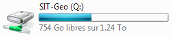
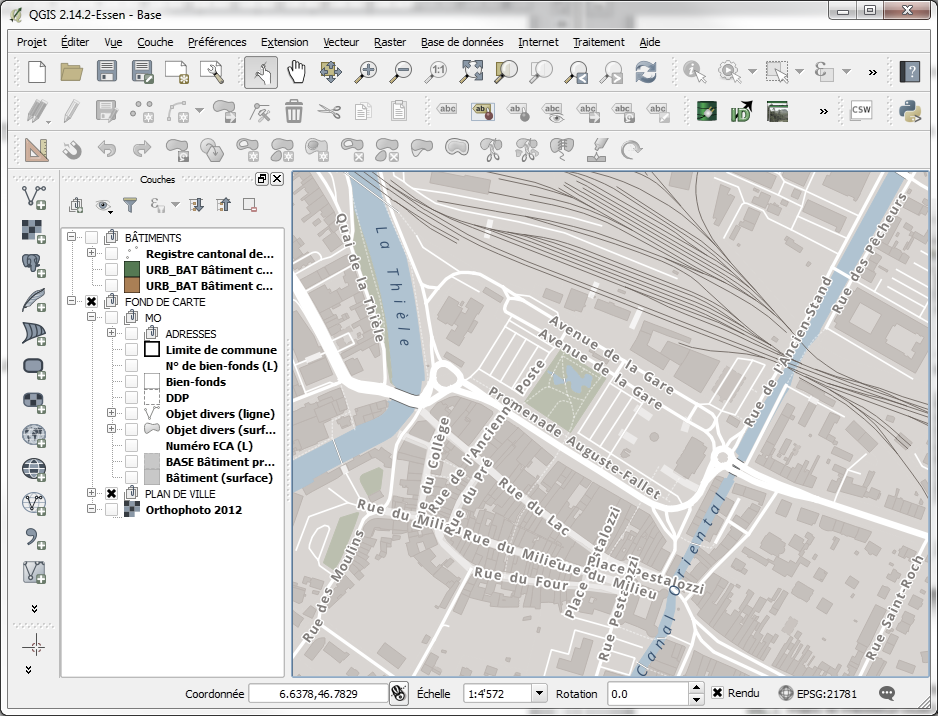
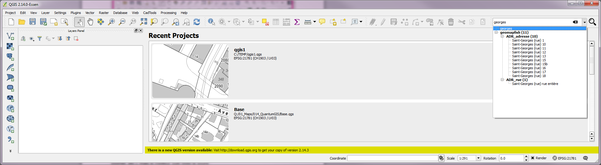
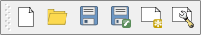

# Introduction

Le but de ce document est de faciliter la prise en main du logiciel QGIS (QuantumGIS) au sein de la commune d’Yverdon-les-Bains. Il est en grande partie inspiré de documents de l’Unité géomatique de la Ville de Nyon, rédigés par Rémi Bovard.
QGIS est un système d’information géographique (SIG). Il sert à créer, éditer, visualiser et analyser des informations géographiques.

# Installation

## Installation du logiciel

Bien que QGIS soit un logiciel open source et qu’il soit disponible librement sur Internet, il est nécessaire de passer par l’Office informatique pour son installation.

## Connexion aux géodonnées

Lors de l’installation, le disque réseau SIT-Geo est également monté sur le lecteur Q.

La plupart des données stockées sur ce lecteur ne sont accessibles qu’en lecture. Voici un aperçu des dossiers les plus utiles à l

- 01_Maps :Projets prédéfinis. Ce sont des cartes prêtes à l’utilisation.
- 02_Geodata : Géodonnées classées par thématique.
- 09_Output : Résultats d’analyses, géotraitements.
- 10_Documents : Documentation diverse, supports de cours

# L'interface

## Généralités

## Navigation

QGIS met à disposition une barre d’outils permettant de naviguer dans la carte (se déplacer, zoomer, etc.), mais le meilleur outil reste la souris :
-	Zoomer : actionner la roulette de la souris
-	Se déplacer : maintenir la roulette enfoncée et déplacer la souris

### Coordonnées

Il est possible de se déplacer sur la carte en saisissant une paire de coordonnées dans la barre de statut, en utilisant une virgule comme séparateur.

###	Recherche

Un outil de recherche identique à celui du géoportail permet de rechercher, par exemple, des adresses, des parcelles ou des bâtiments.

## Barres d'outils

Les principales barres d’outils sont affichées par défaut dans QGIS et sont décrites ci-dessous. Seuls les boutons principaux sont listés, il est toutefois possible de connaître l’action d’un bouton en le survolant avec la souris.
Il est possible de rajouter ou de supprimer des barres d’outils via le menu Vues > Barre d’outils ou on effectuant un clic-droit dans un espace vide de la barre d’outil.

### Fichier

- Nouveau
- Ouvrir
- Sauvegarder
- Sauvegarder sous...
- Nouveau composeur d'impression
- Gestionnaire de composition

### Navigation

