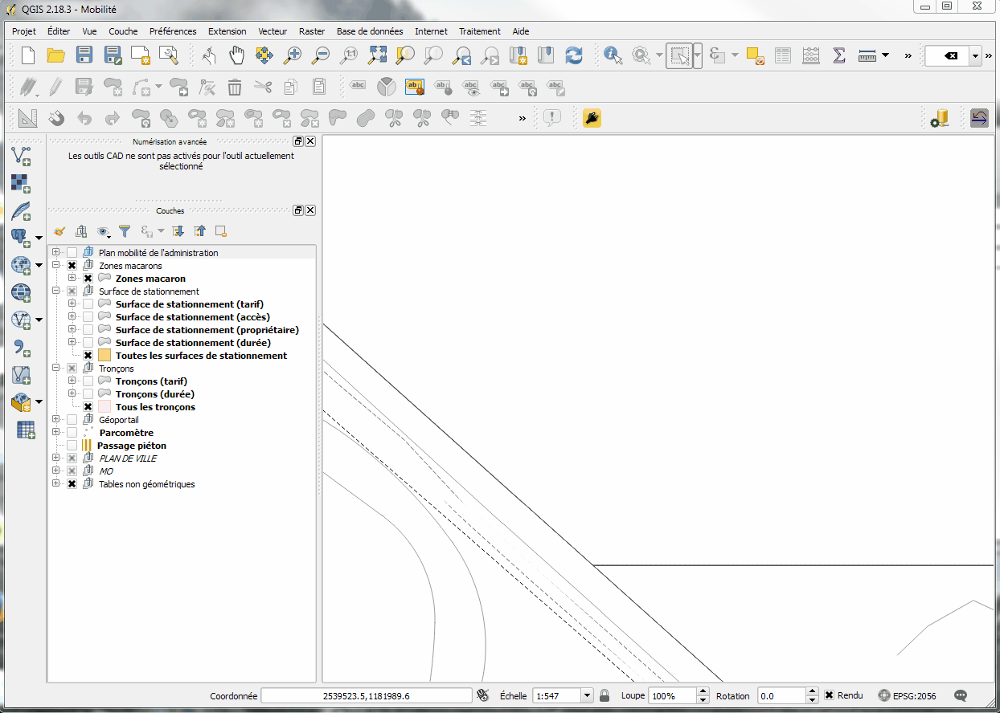
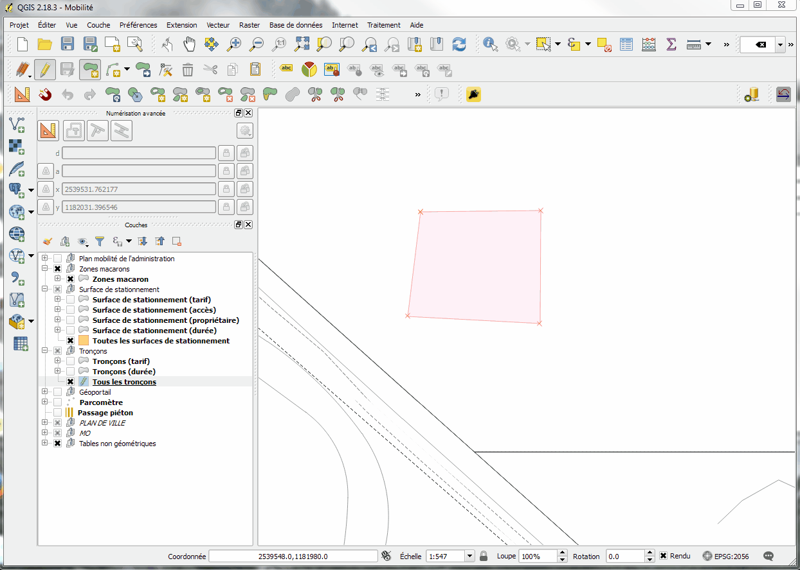
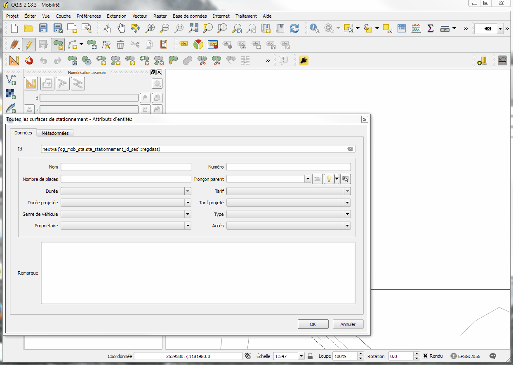
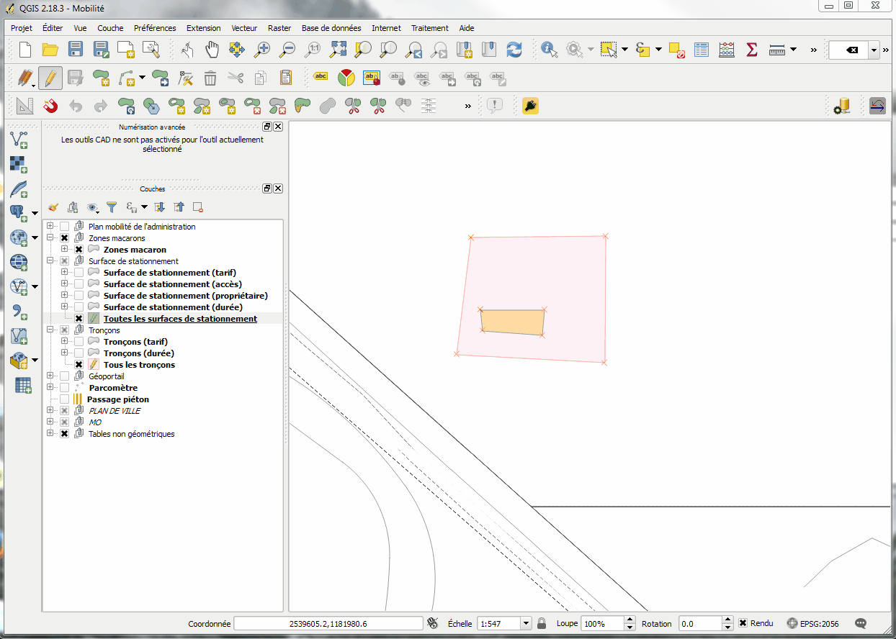

# Saisie des tronçons et des surfaces de stationnement

Saisie du tronçon

Saisie de la surface de stationnement

Liaison de la surface de stationnement au tronçon

En interrogeant la surface de stationnement après avoir enregistré les modifications, les informations de durée et tarif ont été automatiquement liées.

